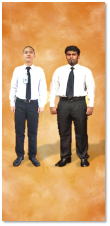
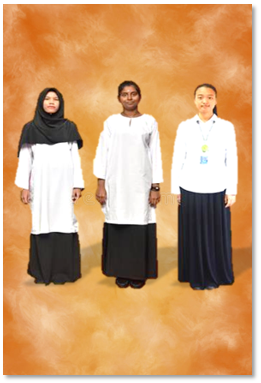
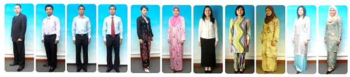

# Dress Code

?> As of COVID-19, dress code hardly applies if you're not in campus. But here they are if COVID ends.

## Classes

- Guys 👦
  - Buttoned top, black pants and sneakers is fine. Remember to tuck in your shirt as well.
- Girls 👧
  - Again, buttoned top, black pants and sneakers.
  - You can also wear dress that is long until it covers the knee.
  - _Baju kurung_ is an option too.
  - If you have long hair, tie up to the back.
  - If you're Muslim, wear a _Hijab (Tudung)_.
- Basically, dress appropriately, as if you're going to work.
- You also need to wear your Matric Card/Student Card with lanyard to classes, otherwise lecturers can mark you as absent even though you're in the class.

!> As of 2020, Polo Ts are no longer allowed and students are required to wear white buttoned tops every Monday.

## Casuals/Sports/Outside Learning Hours

- Guys 👦
  - Any T-Shirt, long pants regardless of color, slippers/sneakers.
- Girls 👧
  - Same thing, any t-shirt, long pants, slippers/sneakers.
  - If you're Muslim, wear a _Hijab (Tudung)_.
- If you're in hostel, wearing short pants is okay. As long you don't wear it in front of wardens.

!> Jeans, tight, or translucent (partially transparent) clothings are not allowed, regardless of in or outside of learning hours.

## Dress Code Examples

Here are a number of examples of attire provided by HEP.

### Orientation Day (1st Week) and Monday Attire

### Regular Class Hours

